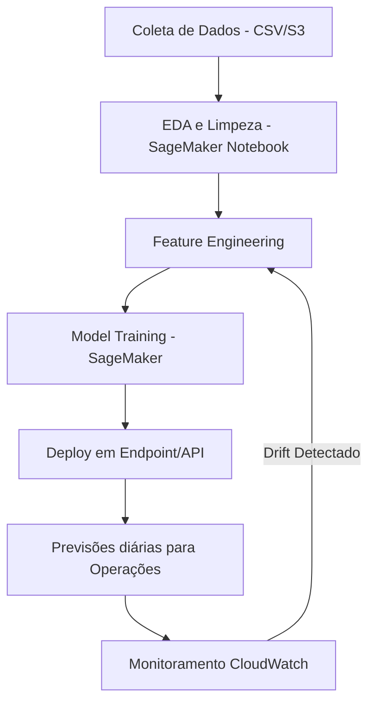

# Arquitetura de Forecast - Produto Alfa

## 1. Contexto do Problema

A empresa **Logística Eficiente S.A.** precisa otimizar sua gestão de estoque do _Produto Alfa_, evitando custos elevados com excesso de armazenamento e minimizando perdas de vendas por falta de estoque. Para isso, é necessário prever a demanda diária do produto nos próximos **14 dias**.

## 2. Objetivos

-   Prever a quantidade de vendas diárias para os próximos 14 dias.
    
-   Incorporar variáveis sazonais (dia da semana, feriados e promoções).
    
-   Implementar o pipeline de dados e modelo na nuvem.
    
-   Monitorar continuamente a performance e acurácia do modelo.
    

## 3. Estrutura do Projeto

### 3.1. Análise Exploratória de Dados (EDA)

-   **Passos:**
    
      1.  Inspeção de valores ausentes, outliers e inconsistências.
        
    2.   Estatísticas descritivas das vendas médias por dia da semana.
        
    3.   Impacto de promoções e feriados na demanda.
        
    4.   Visualizações (tendências temporais, sazonalidades e anomalias).
        
-   **Ferramentas:** Pandas, Matplotlib/Seaborn, Jupyter Notebooks.
  - **Exemplo de Código:**
  ```` python

  import pandas as pd
import matplotlib.pyplot as plt
import seaborn as sns

# Carregar dados
df = pd.read_csv('vendas_produto_alfa.csv', parse_dates=['data'])

# Estatísticas básicas
print(df.describe())

# Vendas ao longo do tempo
plt.figure(figsize=(12,6))
sns.lineplot(data=df, x='data', y='vendas')
plt.title('Vendas do Produto Alfa ao longo do tempo')
plt.show()

# Impacto de promoções
sns.boxplot(x='em_promocao', y='vendas', data=df)
plt.title('Impacto da promoção nas vendas')
plt.show()

# Impacto de feriados
sns.boxplot(x='feriado_nacional', y='vendas', data=df)
plt.title('Impacto de feriado nas vendas')
plt.show()
.
.
.
  ````

### 3.2. Preparação e Limpeza dos Dados

-   Conversão de datas para formato `datetime`.
    
-   Criação de features adicionais:
    
    -   `lag features` (vendas dos últimos 7, 14, 30 dias).
        
    -   `rolling averages` (médias móveis).
        
    -   Encoding de variáveis categóricas (ex: one-hot para dia da semana).
        
-   Tratamento de valores ausentes com interpolação temporal ou imputação.
- **Exemplo de Código:**
````python 
from prophet import Prophet

# Preparar dados
prophet_df = df[['data','vendas']].rename(columns={'data':'ds', 'vendas':'y'})
  
# Adicionar feriados e promoções
from prophet.make_holidays import make_holidays_df

# Para simplificação, consideramos apenas feriados nacionais conhecidos
feriados = df[df['feriado_nacional']==True][['data']].rename(columns={'data':'ds'})
feriados['holiday'] = 'feriado_nacional'
m = Prophet(holidays=feriados, weekly_seasonality=True, daily_seasonality=False)
m.add_regressor('em_promocao')
m.fit(prophet_df.assign(em_promocao=df['em_promocao']))

# Forecast 14 dias
future = m.make_future_dataframe(periods=14)
future['em_promocao'] = 0 # Exemplo sem promoções futuras
forecast = m.predict(future)

# Plotar previsões
m.plot(forecast)
plt.show()
````
### 3.3. Modelagem e Treinamento

-   **Modelos candidatos:**
    
    -   **ARIMA/SARIMA** → para capturar sazonalidade temporal.
        
    -   **Facebook Prophet** → adequado para séries temporais com feriados e sazonalidade.
        
    -   **XGBoost/LightGBM** → para capturar interações complexas entre promoções, feriados e sazonalidade.
        
-   **Validação cruzada temporal:** para evitar _data leakage_.
    
-   **Métricas de avaliação:** RMSE, MAE, MAPE.
-  **Exemplo de Código:**
````python 
import lightgbm as lgb
from sklearn.model_selection import TimeSeriesSplit
from sklearn.metrics import mean_absolute_error
# Features e target

features = ['lag_1','lag_7','lag_14','lag_28','rolling_7','rolling_14','day_of_week','is_weekend','month','em_promocao','feriado_nacional']
X = df[features]
y = df['vendas']
# Time series split
tscv = TimeSeriesSplit(n_splits=5)

for train_idx, test_idx in tscv.split(X):
	X_train, X_test = X.iloc[train_idx], X.iloc[test_idx]
	y_train, y_test = y.iloc[train_idx], y.iloc[test_idx]
	train_data = lgb.Dataset(X_train, label=y_train)
	test_data = lgb.Dataset(X_test, label=y_test, reference=train_data)
	params = {'objective':'regression', 'metric':'mae'}
	model = lgb.train(params, train_data, valid_sets=[test_data], early_stopping_rounds=10)
	y_pred = model.predict(X_test)
	print('MAE:', mean_absolute_error(y_test, y_pred))
````
### 3.4. Deploy do Modelo na Nuvem

-   **Infraestrutura proposta:**
    
    -   Armazenamento de dados: **Amazon S3** (dados brutos e processados).
        
    -   Orquestração: **AWS Step Functions** ou **Airflow no MWAA**.
        
    -   Treinamento: **Amazon SageMaker**.
        
    -   Deploy: **SageMaker Endpoint** ou **API em Lambda + API Gateway**.
        
    -   Banco de dados para histórico: **Amazon RDS** ou **DynamoDB**.
   -  **Exemplo de Código:**
````python 
from fastapi import FastAPI
import pandas as pd
import joblib

app = FastAPI()
model = joblib.load('modelo_lgb.pkl')
@app.post('/predict')
def predict(request: dict):
	df_input = pd.DataFrame([request])
	prediction = model.predict(df_input)
	return {'previsao': prediction.tolist()}
````
### 3.5. Monitoramento e Manutenção

-   **Monitoramento de performance:**
    
    -   Drift de dados (mudanças de distribuição nas features).
        
    -   Acurácia preditiva (comparação previsão vs vendas reais).
        
-   **Ferramentas:**
    
    -   **AWS CloudWatch** (logs e alertas).
        
    -   **SageMaker Model Monitor** (monitoramento de drift).
        
-   **Retreinamento automático:** pipeline que dispara quando a acurácia cai abaixo de um threshold.
- **Exemplo de Código**:
````python
    import boto3

cloudwatch = boto3.client('cloudwatch')
# Enviar MAE diário para CloudWatch
cloudwatch.put_metric_data
	Namespace='ProdutoAlfaForecast',
	MetricData=[{
		'MetricName': 'MAE',
		'Value': 2.3,
		'Unit': 'Count'
}]
)
````
## 4. Fluxo Arquitetural (Pipeline)



## 5. Benefícios da Arquitetura

-   **Escalabilidade:** uso de recursos elásticos da nuvem.
    
-   **Automação:** pipelines de ETL, treinamento e deploy automatizados.
    
-   **Confiabilidade:** monitoramento contínuo e alertas automáticos.
    
-   **Integração com Negócio:** previsões diárias acessíveis via API.
    

## 6. Próximos Passos

-   Criar POC com Prophet e avaliar contra ARIMA e XGBoost.
    
-   Implementar o pipeline em SageMaker.
    
-   Configurar monitoramento e agendamento de previsões automáticas.
    
-   Treinar a equipe de operações para consumir as previsões via dashboard (Power BI/Tableau ou QuickSight).
    
