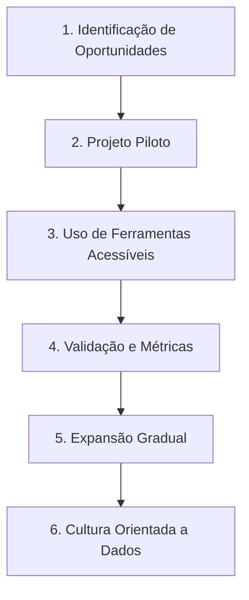
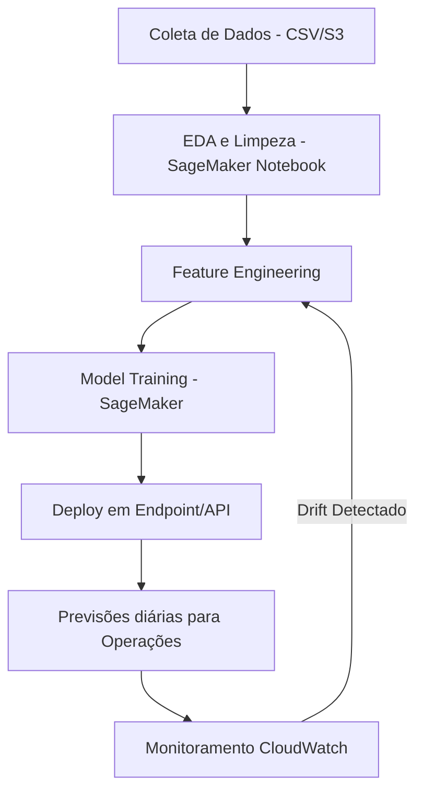
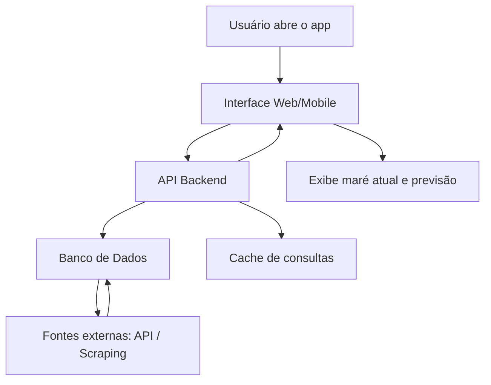

# Solução Pergunta 1 - Implementação de IA em Loja de Varejo
## 1.1. Ajudando a convencer Adriana
Fernanda deve convencer Adriana trazendo a discussão para o que mais importa em negócios: resultados concretos. Em vez de apresentar a Inteligência Artificial como uma novidade técnica, ela deve enquadrá-la como um conjunto de ferramentas práticas já usadas por grandes empresas do varejo, capazes de aumentar receita, reduzir desperdícios e fortalecer a marca.

O primeiro ponto é a experiência do cliente. Empresas que oferecem personalização conseguem ampliar significativamente sua receita. A consultoria McKinsey mostra que negócios que utilizam estratégias personalizadas de atendimento e recomendação chegam a crescer até 40% mais do que concorrentes que não fazem isso. No varejo de roupas, isso pode ser visto quando um cliente compra uma calça jeans e recebe sugestões automáticas de peças que combinam, como jaquetas ou sapatos. O resultado é mais satisfação, fidelização e aumento do ticket médio.

Outro aspecto decisivo é a otimização de estoque e logística. Muitas lojas enfrentam perdas por excesso de produtos parados ou falta de itens de maior procura. A IBM destaca que soluções de previsão podem reduzir os custos de armazenagem em até 30%. Na prática, isso significa que, se uma loja costuma estocar 1.000 unidades de um vestido e só vende 700, pode ajustar esse número e evitar prejuízos. Assim, sobra mais capital para investir em coleções ou campanhas sazonais.

O marketing direcionado também é um diferencial claro. Em vez de campanhas genéricas que atingem todos os clientes, é possível criar ações segmentadas que falam diretamente com perfis específicos. Um estudo da Deloitte aponta que essa prática pode aumentar em até 25% as taxas de conversão. Por exemplo, em vez de mandar uma promoção para 10 mil clientes, a empresa pode focar em 3 mil que realmente têm maior chance de compra, economizando verba e aumentando resultados.

Por fim, Fernanda pode destacar a redução de custos operacionais. O uso de automação em tarefas simples, como respostas sobre prazos de entrega ou políticas de troca, já gera impacto mensurável. Relatórios internacionais mostram que assistentes virtuais no varejo chegam a economizar bilhões anualmente, justamente porque liberam a equipe para atividades de maior valor, como estratégias de expansão e relacionamento próximo com clientes.

Ao apresentar dessa forma, Fernanda não fala de “tecnologia por tecnologia”, mas mostra à Adriana um raciocínio direto: personalização aumenta vendas, previsão de demanda reduz perdas, marketing direcionado melhora conversão e automação diminui custos. É a tradução de inovação em ganho real, sustentada por dados e exemplos de mercado.

## 1.2. Como implementar a adoção de IA na empresa

Convencida dos benefícios, Adriana precisará de um plano prático para começar. A introdução da IA deve ser gradual, estruturada e conectada aos problemas reais do negócio.

### Etapa 1: Identificação de Oportunidades

O primeiro passo é mapear os principais desafios da loja: alto custo com estoque parado, campanhas de marketing pouco efetivas, atendimento demorado, entre outros. Esses problemas serão a base para escolher o uso inicial da IA.

### Etapa 2: Projeto Piloto

Fernanda deve propor um piloto de baixo custo e impacto direto nos resultados. Por exemplo, desenvolver um modelo de previsão de vendas para uma categoria de roupas específica. Essa fase funciona como um teste, mostrando rapidamente se a solução agrega valor.

### Etapa 3: Uso de Ferramentas Acessíveis

Para reduzir complexidade, é possível adotar plataformas já consolidadas que oferecem IA de forma acessível. Exemplos incluem Power BI com recursos de machine learning, Google AutoML ou Azure Cognitive Services. Isso acelera a entrega e reduz a necessidade de grandes investimentos iniciais.

### Etapa 4: Validação e Métricas

Os resultados devem ser avaliados com métricas claras: redução de estoque parado, aumento nas vendas, melhoria no tempo de atendimento. Esses indicadores mostrarão à gerência se o projeto cumpre os objetivos.

### Etapa 5: Expansão Gradual

Uma vez comprovado o valor no piloto, a IA pode ser expandida para outras áreas: marketing personalizado, atendimento automatizado e análise de tendências de moda. O processo de expansão deve ser planejado, garantindo que cada etapa tenha impacto comprovado.

### Etapa 6: Cultura Orientada a Dados

A adoção da IA não se resume a tecnologia. É fundamental investir em capacitação da equipe e estimular o uso de dados em decisões de negócio. Dessa forma, a empresa se torna mais ágil e competitiva no longo prazo.


# Solução Pergunta 2 - Arquitetura de Forecast  Produto Alfa

## 1. Contexto do Problema

A empresa **Logística Eficiente S.A.** precisa otimizar sua gestão de estoque do _Produto Alfa_, evitando custos elevados com excesso de armazenamento e minimizando perdas de vendas por falta de estoque. Para isso, é necessário prever a demanda diária do produto nos próximos **14 dias**.

## 2. Objetivos

-   Prever a quantidade de vendas diárias para os próximos 14 dias.
    
-   Incorporar variáveis sazonais (dia da semana, feriados e promoções).
    
-   Implementar o pipeline de dados e modelo na nuvem.
    
-   Monitorar continuamente a performance e acurácia do modelo.
    

## 3. Estrutura do Projeto

### 3.1. Análise Exploratória de Dados (EDA)

Etapa onde ocorre exploração, compreensão e resumo das principais características do conjunto de dados,
de forma visual e estatística, sem ainda aplicar modelos preditivos complexos.
-   **Passos:**
    
      1.  Inspeção de valores ausentes, outliers e inconsistências.
        
    2.   Estatísticas descritivas das vendas médias por dia da semana.
        
    3.   Impacto de promoções e feriados na demanda.
        
    4.   Visualizações (tendências temporais, sazonalidades e anomalias).
        
-   **Ferramentas:** Pandas, Matplotlib/Seaborn, Jupyter Notebooks.
  - **Exemplo de Código:**
  ```` python

  import pandas as pd
import matplotlib.pyplot as plt
import seaborn as sns

# Carregar dados
df = pd.read_csv('vendas_produto_alfa.csv', parse_dates=['data'])

# Estatísticas básicas
print(df.describe())

# Vendas ao longo do tempo
plt.figure(figsize=(12,6))
sns.lineplot(data=df, x='data', y='vendas')
plt.title('Vendas do Produto Alfa ao longo do tempo')
plt.show()

# Impacto de promoções
sns.boxplot(x='em_promocao', y='vendas', data=df)
plt.title('Impacto da promoção nas vendas')
plt.show()

# Impacto de feriados
sns.boxplot(x='feriado_nacional', y='vendas', data=df)
plt.title('Impacto de feriado nas vendas')
plt.show()
.
.
.
  ````

### 3.2. Preparação e Limpeza dos Dados

Fase que garante que os dados estejam confiáveis, consistentes e prontos para análises estatísticas 
para treinar modelos de machine learning.
- **Passos:**
-   Conversão de datas para formato `datetime`.
    
-   Criação de features adicionais:
    
    -   `lag features` (vendas dos últimos 7, 14, 30 dias).
        
    -   `rolling averages` (médias móveis).
        
    -   Encoding de variáveis categóricas (ex: one-hot para dia da semana).
        
-   Tratamento de valores ausentes com interpolação temporal ou imputação.
- **Exemplo de Código:**
````python 
from prophet import Prophet

# Preparar dados
prophet_df = df[['data','vendas']].rename(columns={'data':'ds', 'vendas':'y'})
  
# Adicionar feriados e promoções
from prophet.make_holidays import make_holidays_df

# Para simplificação, consideramos apenas feriados nacionais conhecidos
feriados = df[df['feriado_nacional']==True][['data']].rename(columns={'data':'ds'})
feriados['holiday'] = 'feriado_nacional'
m = Prophet(holidays=feriados, weekly_seasonality=True, daily_seasonality=False)
m.add_regressor('em_promocao')
m.fit(prophet_df.assign(em_promocao=df['em_promocao']))

# Forecast 14 dias
future = m.make_future_dataframe(periods=14)
future['em_promocao'] = 0 # Exemplo sem promoções futuras
forecast = m.predict(future)

# Plotar previsões
m.plot(forecast)
plt.show()
````
### 3.3. Modelagem e Treinamento
É a fase em que aplicamos modelos estatísticos ou de aprendizado de máquina aos dados já tratados,
com o objetivo de aprender padrões e gerar previsões/insights.

-   **Modelos candidatos:**
    
    -   **ARIMA/SARIMA** → para capturar sazonalidade temporal.
        
    -   **Facebook Prophet** → adequado para séries temporais com feriados e sazonalidade.
        
    -   **XGBoost/LightGBM** → para capturar interações complexas entre promoções, feriados e sazonalidade.
        
-   **Validação cruzada temporal:** para evitar _data leakage_.
    
-   **Métricas de avaliação:** RMSE, MAE, MAPE.
-  **Exemplo de Código:**
````python 
import lightgbm as lgb
from sklearn.model_selection import TimeSeriesSplit
from sklearn.metrics import mean_absolute_error
# Features e target

features = ['lag_1','lag_7','lag_14','lag_28','rolling_7','rolling_14','day_of_week','is_weekend','month','em_promocao','feriado_nacional']
X = df[features]
y = df['vendas']
# Time series split
tscv = TimeSeriesSplit(n_splits=5)

for train_idx, test_idx in tscv.split(X):
	X_train, X_test = X.iloc[train_idx], X.iloc[test_idx]
	y_train, y_test = y.iloc[train_idx], y.iloc[test_idx]
	train_data = lgb.Dataset(X_train, label=y_train)
	test_data = lgb.Dataset(X_test, label=y_test, reference=train_data)
	params = {'objective':'regression', 'metric':'mae'}
	model = lgb.train(params, train_data, valid_sets=[test_data], early_stopping_rounds=10)
	y_pred = model.predict(X_test)
	print('MAE:', mean_absolute_error(y_test, y_pred))
````
### 3.4. Deploy do Modelo na Nuvem

-   **Infraestrutura proposta:**
    
    -   Armazenamento de dados: **Amazon S3** (dados brutos e processados).
        
    -   Orquestração: **AWS Step Functions** ou **Airflow no MWAA**.
        
    -   Treinamento: **Amazon SageMaker**.
        
    -   Deploy: **SageMaker Endpoint** ou **API em Lambda + API Gateway**.
        
    -   Banco de dados para histórico: **Amazon RDS** ou **DynamoDB**.
   -  **Exemplo de Código:**
````python 
from fastapi import FastAPI
import pandas as pd
import joblib

app = FastAPI()
model = joblib.load('modelo_lgb.pkl')
@app.post('/predict')
def predict(request: dict):
	df_input = pd.DataFrame([request])
	prediction = model.predict(df_input)
	return {'previsao': prediction.tolist()}
````
### 3.5. Monitoramento e Manutenção

-   **Monitoramento de performance:**
    
    -   Drift de dados (mudanças de distribuição nas features).
        
    -   Acurácia preditiva (comparação previsão vs vendas reais).
        
-   **Ferramentas:**
    
    -   **AWS CloudWatch** (logs e alertas).
        
    -   **SageMaker Model Monitor** (monitoramento de drift).
        
-   **Retreinamento automático:** pipeline que dispara quando a acurácia cai abaixo de um threshold.
- **Exemplo de Código**:
````python
    import boto3

cloudwatch = boto3.client('cloudwatch')
# Enviar MAE diário para CloudWatch
cloudwatch.put_metric_data
	Namespace='ProdutoAlfaForecast',
	MetricData=[{
		'MetricName': 'MAE',
		'Value': 2.3,
		'Unit': 'Count'
}]
)
````
## 4. Fluxo Arquitetural (Pipeline)



## 5. Benefícios da Arquitetura Proposta

-   **Escalabilidade:** uso de recursos elásticos da nuvem.
    
-   **Automação:** pipelines de ETL, treinamento e deploy automatizados.
    
-   **Confiabilidade:** monitoramento contínuo e alertas automáticos.
    
-   **Integração com Negócio:** previsões diárias acessíveis via API.
    

## 6. Passos Seguintes 

-   Criar POC com Prophet e avaliar contra ARIMA e XGBoost.
    
-   Implementar o pipeline em SageMaker.
    
-   Configurar monitoramento e agendamento de previsões automáticas.
    
-   Treinar a equipe de operações para consumir as previsões via dashboard (Power BI/Tableau ou QuickSight).
    


# Solução Pergunta 3 - Sistema de Consulta de Marés

##  Descrição do Problema

Marcelo, surfista em Itapuama, precisa verificar o nível da maré antes de praticar surf. O processo atual é manual: ele busca em vários sites até encontrar a informação, o que é **lento e pouco prático**.

Além disso, Marcelo gostaria de ter acesso a informações de marés não só em Itapuama, mas também em **outras praias do Brasil**.


##  Objetivo da Solução

Criar uma aplicação simples que seja simples e eficaz, buscando sempre o maior desempenho com o mínimo possivel de custos e complexidades desnecessárias.
A aplicação seguirá  esses pilares fundamentais:

1. **Automatizar a consulta do nível da maré**.
2. **Centralizar as informações em um só lugar**.
3. **Fornecer previsões atualizadas em tempo real**.
4. **Ser escalável**, permitindo incluir novas praias facilmente.


##  Escopo da Solução

A aplicação foi pensada para seguir  quatro etapas principais que facilitarão o projeto:

### 1. Coleta de Dados
Esta etapa será responsável por manter o banco de dados abstecido com os dados das marés em tempo real, para isso serão usadas APIs de informações oficiais emitidas por orgãos que monitoram esse tipo de evento, além do uso de Web Scraping para procurar informações em sites confiáveis.
* Consulta a **APIs públicas ou oficiais** (como a Marinha do Brasil).
* Quando não houver API, utiliza-se **web scraping** para extrair os dados de sites confiáveis.

### 2. Processamento
Esta etapa será responsavel por processar os dados que virão da etapa de coleta, afim de padroniza-los e deixa- los pronto para armazenamento e utilização.
* Os dados podem vir em diferentes formatos.
* Essa etapa organiza e padroniza tudo em um formato único (por exemplo: JSON).

### 3. Armazenamento
Etapa responsável pelo armazanamento das informações coletadas e processadas em um banco de dados na nuvem.
* Banco de dados (PostgreSQL ou MongoDB) guarda os registros de maré.
* Cache (Redis) pode ser usado para **consultas rápidas em praias favoritas**.

### 4. Exibição para o Usuário
Camada de interface com usuário usada para fazer exibição das informações das marés de forma acessível e de facíl entendimento.
* **Backend (API REST)** feito em Python com FastAPI ou Flask.
* **Interface Web/Mobile** simples onde Marcelo pode:

  * Buscar pelo nome da praia.
  * Ver o nível atual da maré.
  * Consultar um gráfico com previsão de alta/baixa maré.
  * Salvar praias favoritas.

---

##  Fluxo Resumido



---

##  Exemplo de Código (Consulta Simples)

```python
import requests

def obter_mare(praia: str):
    url = f"https://api.exemplo.com/mare?praia={praia}"
    resposta = requests.get(url)
    
    if resposta.status_code == 200:
        dados = resposta.json()
        return {
            "praia": praia,
            "nivel_mare": dados["nivel"],
            "hora": dados["hora"]
        }
    
    return {"erro": "Não foi possível obter os dados"}

print(obter_mare("Itapuama"))
```

Esse trecho representa a lógica de buscar a maré de uma praia.
Em um sistema real, esse código seria integrado a um backend e conectado ao frontend.

---

##  Exemplo de Interface

Quando Marcelo consulta Itapuama, o sistema retorna algo como:

```
 Praia: Itapuama  
 Nível da maré: 1.8m  
 Atualizado em: 14/09/2025 - 09:30  

[Gráfico: variação da maré nas próximas 12h]
```

---

##  Benefícios da Solução Proposta 

* **Centralização**: todas as informações em um único lugar.
* **Agilidade**: elimina a necessidade de buscas manuais.
* **Escalabilidade**: pode ser facilmente expandido para novas praias.
* **Usabilidade**: interface simples e clara.


