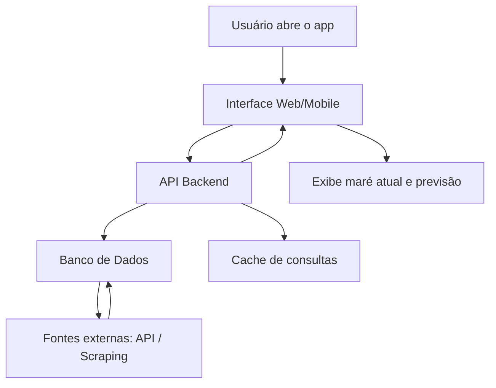

#  Sistema de Consulta de Marés

##  Descrição do Problema

Marcelo, surfista em Itapuama, precisa verificar o nível da maré antes de praticar surf. O processo atual é manual: ele busca em vários sites até encontrar a informação, o que é **lento e pouco prático**.

Além disso, Marcelo gostaria de ter acesso a informações de marés não só em Itapuama, mas também em **outras praias do Brasil**.


##  Objetivo da Solução

Criar uma aplicação simples que seja simples e eficaz, buscando sempre o maior desempenho com o mínimo possivel de custos e complexidades desnecessárias.
A aplicação seguirá atender a esses pilares fundamentais:

1. **Automatizar a consulta do nível da maré**.
2. **Centralizar as informações em um só lugar**.
3. **Fornecer previsões atualizadas em tempo real**.
4. **Ser escalável**, permitindo incluir novas praias facilmente.


##  Escopo da Solução

A aplicação foi pensada para seguir  quatro etapas principais que facilitarão o projeto:

### 1. Coleta de Dados
Esta etapa será responsável por manter o banco de dados abstecido com os dados das marés em tempo real, para isso serão usadas APIs de informações oficiais emitidas por orgãos que monitoram esse tipo de evento, além do uso de Web Scraping para procurar informações em sites confiáveis.
* Consulta a **APIs públicas ou oficiais** (como a Marinha do Brasil).
* Quando não houver API, utiliza-se **web scraping** para extrair os dados de sites confiáveis.

### 2. Processamento
Esta etapa será responsavel por processar os dados que virão da etapa de coleta, afim de padroniza-los e deixa- los pronto para armazenamento e utilização.
* Os dados podem vir em diferentes formatos.
* Essa etapa organiza e padroniza tudo em um formato único (por exemplo: JSON).

### 3. Armazenamento
Etapa responsável pelo armazanamento das informações coletadas e processadas em um banco de dados na nuvem.
* Banco de dados (PostgreSQL ou MongoDB) guarda os registros de maré.
* Cache (Redis) pode ser usado para **consultas rápidas em praias favoritas**.

### 4. Exibição para o Usuário
Camada de interface com usuário usada para fazer exibição das informações das marés de forma acessível e de facíl entendimento.
* **Backend (API REST)** feito em Python com FastAPI ou Flask.
* **Interface Web/Mobile** simples onde Marcelo pode:

  * Buscar pelo nome da praia.
  * Ver o nível atual da maré.
  * Consultar um gráfico com previsão de alta/baixa maré.
  * Salvar praias favoritas.

---

##  Fluxo Resumido



---

##  Exemplo de Código (Consulta Simples)

```python
import requests

def obter_mare(praia: str):
    url = f"https://api.exemplo.com/mare?praia={praia}"
    resposta = requests.get(url)
    
    if resposta.status_code == 200:
        dados = resposta.json()
        return {
            "praia": praia,
            "nivel_mare": dados["nivel"],
            "hora": dados["hora"]
        }
    
    return {"erro": "Não foi possível obter os dados"}

print(obter_mare("Itapuama"))
```

Esse trecho representa a lógica de buscar a maré de uma praia.
Em um sistema real, esse código seria integrado a um backend e conectado ao frontend.

---

##  Exemplo de Interface

Quando Marcelo consulta Itapuama, o sistema retorna algo como:

```
 Praia: Itapuama  
 Nível da maré: 1.8m  
 Atualizado em: 14/09/2025 - 09:30  

[Gráfico: variação da maré nas próximas 12h]
```

---

##  Benefícios da Solução

* **Centralização**: todas as informações em um único lugar.
* **Agilidade**: elimina a necessidade de buscas manuais.
* **Escalabilidade**: pode ser facilmente expandido para novas praias.
* **Usabilidade**: interface simples e clara.


